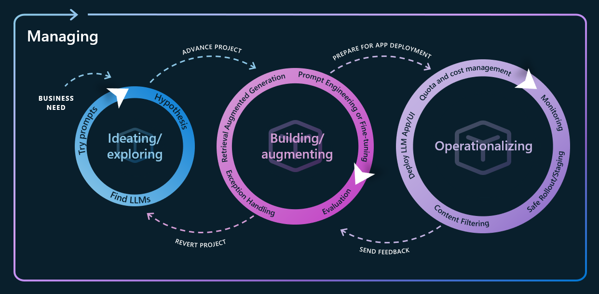
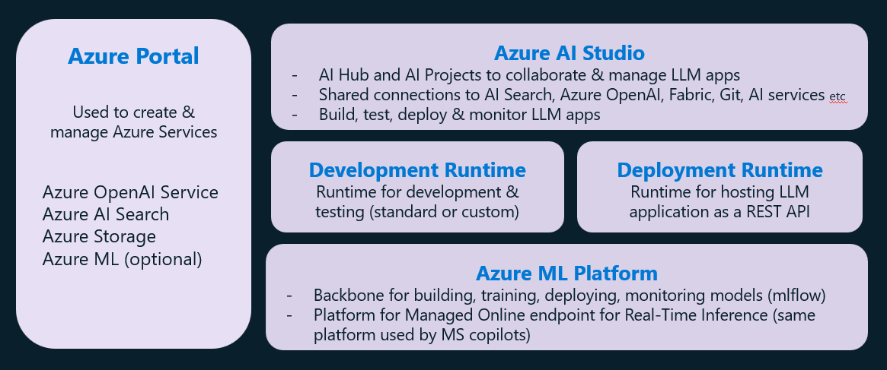

# LLM Application Development Lifecycle workshop
 
## Workshop Overview
 This workshop provides hands-on experience with the end-to-end lifecycle of Large Language Model (LLM) applications using Azure AI platform. The workshop covers the LLM application development lifecycle shown in the below diagram.

 

 ## Lab Scenarios
 This workshop provides hands-on experience with the following scenarios:
 1. Prompt Engineering techniques.
 2. Create a hybrid search solution using Azure AI Search that includes vector search.
 3. Create a RAG (Retrieval Augmented Generation) application using PromptFlow in Azure AI Studio.
 4. Test & evaluate RAG application using PromptFlow in Azure AI Studio.
 5. Deploy RAG application and consume it using REST API.

 Diagram below depicts the Azure AI platform components used in the workshop scenarios.
 

 ## Workshop hands-on labs Implementation Instructions
 Lab instructions and resources are provided in the respective folders in this repo. 
 
 [RECOMMENDED SEQUENCE] Follow the instructions in the folders to complete the labs.
 1. [Lab 0: Azure Environment Setup for the workshop](Environment-Preparation/Environment-Setup-For-Workshop.pdf)
 2. [Lab 1: Prompt Engineering Techniques](PromptEngineering/PromptEngineering-Summary-Resources.pdf)
 3. [Lab 2: Create a hybrid search solution using Azure AI Search](AzureAISearch-VectorSearch/AzureAISearch-CreateHybridSearch-with-VectorSearch.pdf)
 4. [Lab 3: Create a RAG application using PromptFlow in Azure AI Studio](RAGapp-PromptFlow/RAG-application-Promptflow.pdf)
 5. [Lab 4: Test & evaluate RAG application using PromptFlow in Azure AI Studio](LLMapp-Evaluation/Evaluate-LLMapps-using-AzureAIStudio.pdf)
 6. [Lab 5: Deploy RAG application and consume it using REST API](LLMapp-Deployment-Monitoring/Deploy-Monitor-LLMapps-AzureAIStudio.pdf)

 ## Workshop Prerequisites
 1. Azure subscription.
 2. Access to Azure OpenAI service.
 3. Azure AI Search service
 4. Azure Storage account.

## Additional Resources
- [Advance your maturity level for Large Language Model Operations (LLMOps)](https://learn.microsoft.com/en-us/azure/machine-learning/prompt-flow/concept-llmops-maturity)
- [What is Azure AI Studio?](https://learn.microsoft.com/en-us/azure/ai-studio/what-is-ai-studio)
- [What is Azure AI Search?](https://learn.microsoft.com/en-us/azure/search/search-what-is-azure-search)
- [Custom Conversation Copilot application using multimodal AI](https://github.com/amulchapla/AI-Conversational-Copilot)